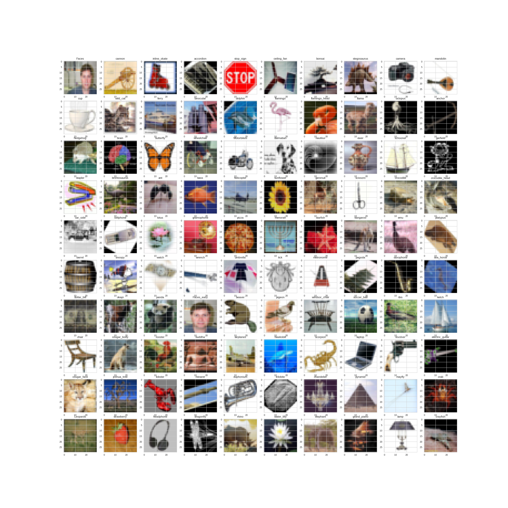
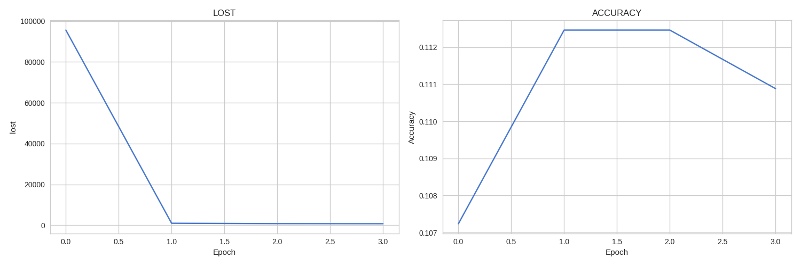
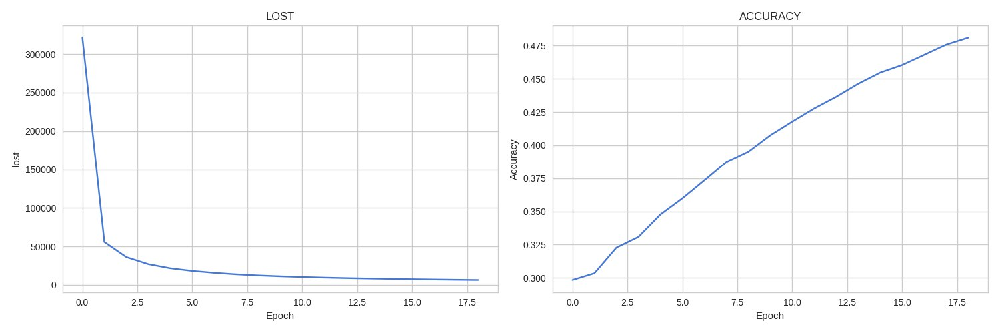
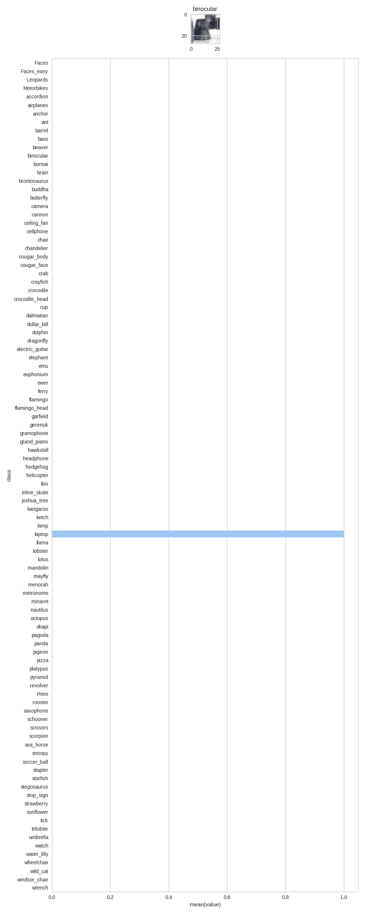

# Image-Recognition-using-CNN
This repository introduction to Convolutional Neural Network with dropout and l2 loss to detect 100 classes of images

## [Dataset download from here](http://www.vision.caltech.edu/Image_Datasets/Caltech101/)
It contains 102 of picture categories, consist more than 8k pictures.

## You need to configure settings in settings.py
```python
location = '/home/project/101_ObjectCategories/'
current_location = os.getcwd()
picture_dimension = 28
learning_rate = 0.01

enable_dropout = False
dropout_probability = 1.0

enable_penalty = False
penalty = 0.0005
batch_size = 20
epoch = 1000

split_percentage = 0.2

Train = False

test_number = 10
```




The model works perfectly.


This is barplot for random picture

